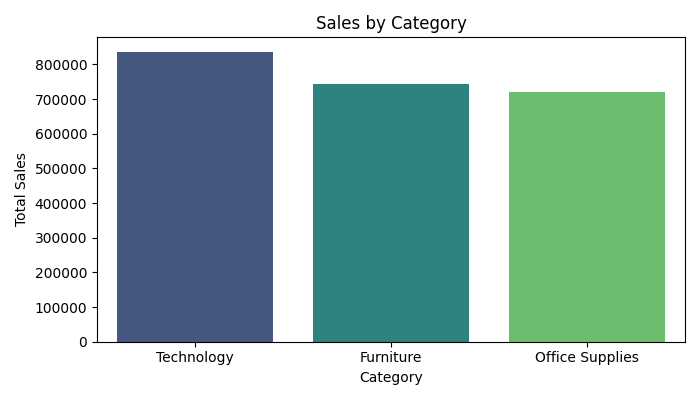
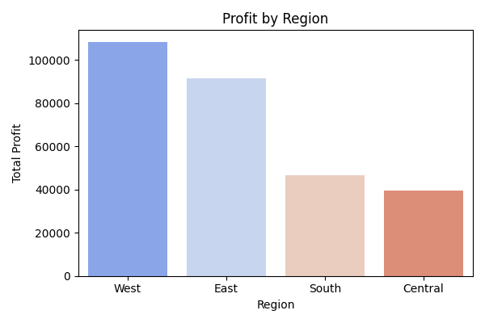
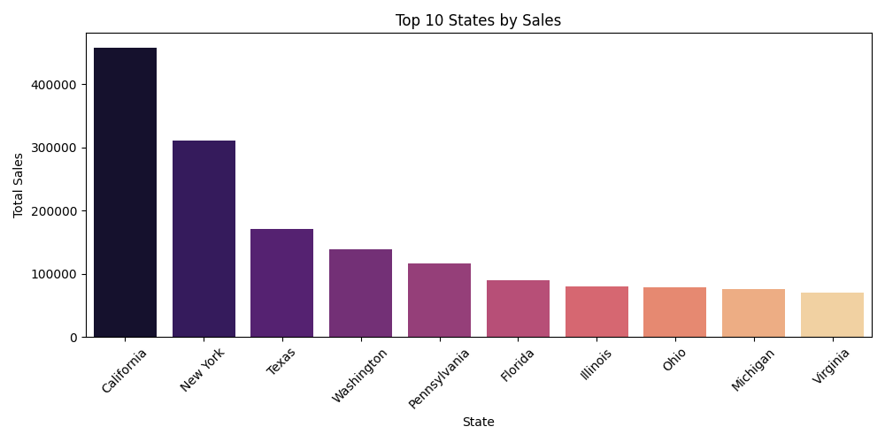
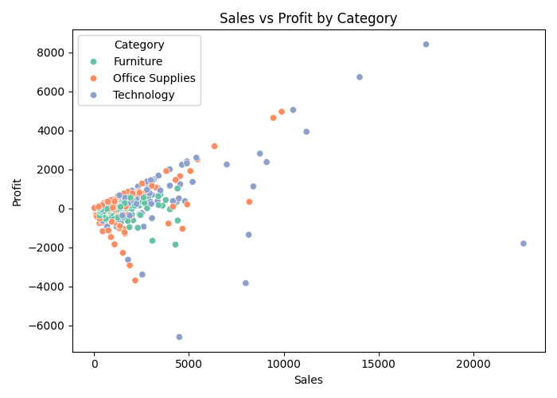
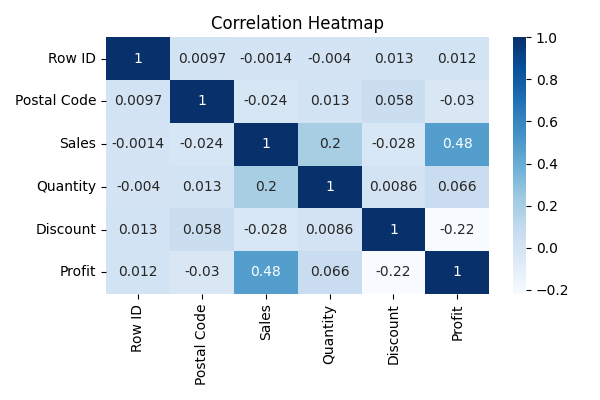

#  Sales Data Analysis — Superstore Dataset

This project performs **exploratory data analysis (EDA)** on the _Sample Superstore_ dataset using Python.  
It uncovers key insights about sales, profit, and product performance across different regions, categories, and states.

---

## 📁 Project Structure


---

## 🚀 Features

- Data cleaning (duplicate & null handling)
- Sales and profit insights by **Category**, **Region**, and **State**
- Correlation analysis between key metrics
- Automatic chart generation and saving
- Exports cleaned data for future use

---

## 🚀 Features

- Data cleaning (duplicate & null handling)
- Sales and profit insights by **Category**, **Region**, and **State**
- Correlation analysis between key metrics
- Automatic chart generation and saving
- Exports cleaned data for future use

---

## 🧠 Technologies Used

| Purpose       | Tool/Library                  |
| ------------- | ----------------------------- |
| Data Analysis | `pandas`, `numpy`             |
| Visualization | `matplotlib`, `seaborn`       |
| Environment   | Python 3.x, VS Code / Jupyter |

---

## 📊 Key Insights

- **Highest Sales:** Furniture (₹7.41L), followed closely by Office Supplies (₹7.19L).
- **Highest Profit:** Technology category contributed maximum profit (~₹1.45L).
- **Top Performing Region:** West region showed the highest profit (~₹1.08L).
- **Top 3 States by Sales:** California, New York, and Texas.
- Discount negatively impacts profit, showing over-discounted products reduce margin.

---

## 🖼️ Visual Output

### 🔹 Sales by Category



### 🔹 Profit by Region



### 🔹 Top 10 States by Sales



### 🔹 Sales vs Profit by Category



### 🔹 Correlation Heatmap



---

## ⚙️ How to Run the Project

1. Clone the repository
   ```bash
   git clone https://github.com/adityamishras/Sales-Data-Analysis.git
   cd Sales-Data-Analysis
   ```

Total Sales: ₹ 1,858,492.49
Total Profit: ₹ 286,396.02
Top 3 States by Sales:

- California: ₹457,687
- New York: ₹310,876
- Texas: ₹170,188

---

### **What You Need to Do**

1. Put this text into your `README.md` file.
2. Inside your repo, make sure the folder structure is:
   charts/
   sales_by_category.png
   profit_by_region.png
   top_10_states.png
   sales_vs_profit.png
   correlation_heatmap.png
3. When you push this to GitHub, the images will display automatically.

---
